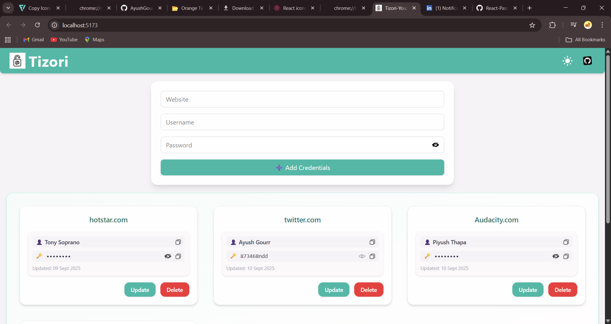

# React Password Manager 🔐

A simple, user-friendly **Password Manager** built with **React** and **Tailwind CSS**.  
Store, update, and manage your website credentials securely in your browser using **localStorage**.  

---

## Features ✨

- Add, update, and delete credentials (Website, Username, Password).  
- Toggle password visibility (show/hide).  
- Copy username or password to clipboard with a single click.  
- Responsive design: works perfectly on mobile, tablet, and desktop.  
- Smooth UI animations using **Framer Motion**.  
- Instant notifications using **react-hot-toast**.  

---

## Screenshots 🖼️





---

## Installation & Usage 💻

1. Clone the repo:  
   ```bash
   git clone https://github.com/AyushGour-crack-it/React-Password-Manager.git
   ```

2. Navigate to the project folder:

   ```bash
   cd React-Password-Manager
   ```

3. Install dependencies:

   ```bash
   npm install
   ```

4. Start the development server:

   ```bash
   npm run dev
   ```

5. Open [http://localhost:5173](http://localhost:5173) in your browser.

---

## Tech Stack 🛠️

* **React** – Frontend library
* **Tailwind CSS** – Styling
* **Framer Motion** – Animations
* **React Hot Toast** – Notifications
* **Vite** – Development server & build tool

---

## License 📄

This project is licensed under the **MIT License** – see the [LICENSE](LICENSE) file for details.
